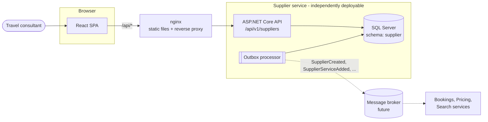
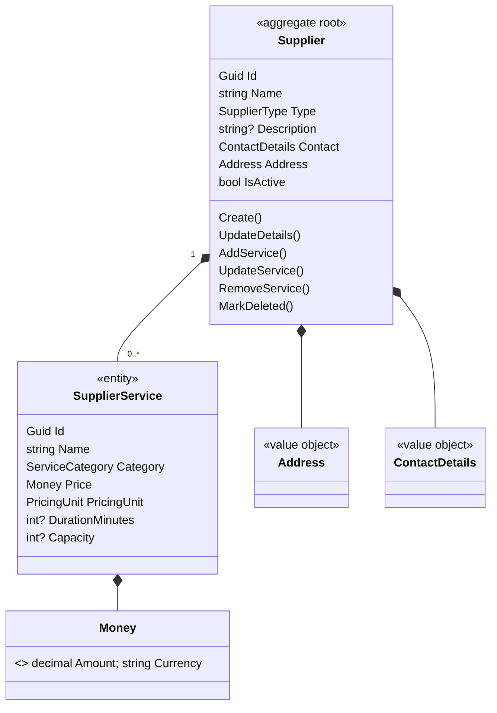

# Architecture and design decisions

This document explains how the solution is put together and why. Each decision lists the options considered and the trade-off accepted.

## Contents

1. [System context](#1-system-context)
2. [The Supplier service as an independent microservice](#2-the-supplier-service-as-an-independent-microservice)
3. [Layering: Clean Architecture](#3-layering-clean-architecture)
4. [Domain model](#4-domain-model)
5. [Commands and queries](#5-commands-and-queries)
6. [Errors and validation](#6-errors-and-validation)
7. [Persistence](#7-persistence)
8. [Optimistic concurrency](#8-optimistic-concurrency)
9. [Integration events: the transactional outbox](#9-integration-events-the-transactional-outbox)
10. [API design](#10-api-design)
11. [Operability](#11-operability)
12. [Front end](#12-front-end)
13. [Testing strategy](#13-testing-strategy)
14. [What I would add next](#14-what-i-would-add-next)

---

## 1. System context



The browser only ever talks to one origin. nginx (or the Vite dev server when developing) serves the SPA and forwards `/api` to the Supplier service. In a larger system, an API gateway takes nginx's place, and other services learn about supplier changes from events rather than by calling this service.

## 2. The Supplier service as an independent microservice

The brief asks for an API that "could be workable as part of a broader microservice project". Concretely:

| Concern | How the service stays independent |
| --- | --- |
| Code | Lives in `services/supplier` with its own solution, `Directory.Build.props`, central package versions and `.editorconfig`. It shares no code with anything else and could be moved to its own repository unchanged. |
| Data | Owns its database and a dedicated `supplier` schema, including its own migrations history table. No other service reads its tables; they use the API or its events. |
| Contract | A versioned HTTP API (`/api/v1/...`) described by OpenAPI, with RFC 9457 problem details for errors. Consumers depend on the contract, not the implementation. |
| Deployment | Its own Dockerfile (multi-stage, non-root) and its own CI workflow that runs only when its code changes. |
| Configuration | Everything comes from configuration/environment variables (`ConnectionStrings__SuppliersDb`, `Outbox__*`, `Cors__*`, `OTEL_EXPORTER_OTLP_ENDPOINT`), per 12-factor. |
| Collaboration | Publishes integration events through a transactional outbox, so other services can react to changes without coupling to its database or availability. |
| Operations | Liveness and readiness probes, structured logs, correlation ids and OpenTelemetry traces/metrics, all things an orchestrator and a platform team expect. |
| Scale out | Stateless. The outbox processor is safe to run on several instances at once (see §9). |

## 3. Layering: Clean Architecture

```
Api ──► Infrastructure ──► Application ──► Domain
 └──────────────────────────► Application
```

| Project | Responsibility | Depends on |
| --- | --- | --- |
| `Domain` | Aggregates, entities, value objects, domain events and the business rules. | Nothing (no NuGet packages at all) |
| `Application` | Use cases (`SupplierCommands`), request/response contracts, validators, and the ports it needs (`ISupplierRepository`, `IUnitOfWork`, `ISupplierQueries`). | Domain, FluentValidation |
| `Infrastructure` | EF Core + SQL Server implementation of the ports, migrations, outbox, health checks. | Application |
| `Api` | HTTP: controllers, problem details, versioning, OpenAPI, middleware, telemetry, composition root. | Application, Infrastructure |

**Why:** the business rules can be read and tested without a database or web server, and the storage or transport can change without touching them. For a service this size, four projects are the most I would use. Splitting further (a MediatR pipeline, a project per feature) would add ceremony without adding value.

**Considered:** a single project with folders (vertical slices). That's a reasonable choice for small services. I chose explicit layers because the brief asks to showcase architecture, and because the compiler then enforces the dependency rule.

## 4. Domain model



* **Supplier is the aggregate root, and its services are part of the aggregate.** A service has no meaning without its supplier, and some rules span the whole collection (service names are unique per supplier; at most 200 services). All changes go through `Supplier`, which is the only place those rules can be enforced reliably.
* **Value objects** (`Money`, `Address`, `ContactDetails`) are immutable records that validate themselves. `Money` refuses negative amounts, more than two decimals and anything that is not a 3-letter ISO 4217 code.
* **Encapsulation:** setters are private, the services collection is exposed read-only, and the constructors EF Core needs are private.
* **Enums are stored and serialised as strings.** Adding a new supplier type is then a non-breaking change for the database and for API clients, and the data is readable in SQL. The front end reads the allowed values from `/reference-data` instead of hard-coding them.
* **IDs are version 7 GUIDs** (`Guid.CreateVersion7()`). The domain can create IDs itself (no database round trip, unlike identity columns), and because they are time-ordered, inserts append to the clustered index instead of fragmenting it the way random GUIDs do.
* **Domain events** (`SupplierCreated`, `SupplierServiceAdded`, ...) are recorded by the aggregate and turned into outbox messages when it is saved (§9).

## 5. Commands and queries

A light CQRS split, with no separate databases or messaging:

* **Commands** (`SupplierCommands`) load the aggregate through `ISupplierRepository`, call domain methods, and commit with `IUnitOfWork`. This is where invariants are enforced.
* **Queries** (`ISupplierQueries`, implemented in Infrastructure) project directly from SQL into response DTOs with `AsNoTracking`. The list query selects only the columns the list shows, plus a service count and distinct categories, in one round trip.

**Why:** reads and writes have different needs. Loading whole aggregates just to render a list wastes work, and pushing display concerns into the domain model pollutes it. The split is cheap here and gives a natural place to add caching or a read replica later.

## 6. Errors and validation

**Expected failures are values, not exceptions.** Use cases return `Result` / `Result<T>` carrying an `Error` with a type (`Validation`, `NotFound`, `Conflict`), a stable machine-readable `code` (`supplier_name_taken`, `concurrency_conflict`, ...) and a message. The API maps these to [RFC 9457 problem details](https://www.rfc-editor.org/rfc/rfc9457):

```json
{
  "type": "https://tools.ietf.org/html/rfc9110#section-15.5.1",
  "title": "One or more fields are invalid.",
  "status": 400,
  "errors": { "name": ["'Name' must not be empty."], "services[0].currency": ["Currency must be a three letter ISO 4217 code, e.g. ZAR."] },
  "code": "validation_failed",
  "traceId": "00-4bf92f...",
  "correlationId": "4bf92f3577b34da6a3ce929d0e0e4736"
}
```

Unexpected failures are exceptions, caught by one `IExceptionHandler` that logs them and returns a generic 500 problem, so no stack traces leak.

**Validation happens in layers, each for a different reason:**

| Layer | Purpose |
| --- | --- |
| Zod schemas (front end) | Instant feedback while typing. It's only a convenience, and the server never relies on it. |
| FluentValidation (Application) | Returns *all* problems at once, with JSON paths (`services[0].price`) the UI maps straight back onto its fields. MVC's implicit `[Required]` is switched off so this is the one source of request validation. |
| Domain guards | Keep the aggregate valid regardless of caller: another use case, a message handler or a seeding script. |
| Database constraints | Unique indexes, check constraints and a foreign key with cascade. These are the last line of defence against races and bugs. A unique-index violation is translated into the same `409` a pre-check would produce. |

## 7. Persistence

* **EF Core 10 + SQL Server.** Value objects map to columns on the owning row using EF Core **complex types**, so there are no extra tables or joins for `Address` or `Money`.
* **Migrations** are checked in. For local and demo runs the service applies them at startup (`Database:MigrateOnStartup`). In production I would run a migration bundle as a separate deployment step, so app instances never race to change the schema and the app's login does not need DDL rights.
* **Resilience:** `EnableRetryOnFailure` retries transient SQL errors (failover, throttling, the container still starting). The explicit transaction in the outbox processor runs inside the execution strategy, as retries require.
* **Audit timestamps** (`CreatedAtUtc`, `UpdatedAtUtc`) are set centrally in `SaveChangesAsync` using an injected `TimeProvider`, so tests can control time.

## 8. Optimistic concurrency

Two consultants editing the same supplier must not silently overwrite each other.

* Each supplier row has a SQL Server `rowversion`, mapped as a **shadow property** so this persistence detail stays out of the domain model.
* Reads return it as an opaque `version` string. Updates must send it back. If the row has changed since, SQL Server matches no rows, EF raises a concurrency exception, and the API returns `409 concurrency_conflict`. The UI then offers to load the latest version.
* **The concurrency check covers the whole aggregate.** Adding, changing or removing a *service* also touches the supplier row, which bumps its version. Otherwise two people could change a supplier's services concurrently without either being told.

## 9. Integration events: the transactional outbox

Other services (bookings, pricing, search) need to know when suppliers change. Publishing to a broker straight after `SaveChanges` risks the *dual write* problem: the database commit succeeds but the publish fails, or the reverse.

1. When an aggregate is saved, its domain events are serialised into an `OutboxMessages` table **in the same transaction** as the state change. An event exists only if the change was committed.
2. A background `OutboxProcessor` reads unprocessed messages in order (`OccurredAtUtc`, then `Sequence` within a transaction), publishes each one through `IIntegrationEventPublisher`, and marks it processed.
3. Rows are claimed with `UPDLOCK, READPAST, ROWLOCK`, so several instances of the service can process the outbox concurrently without publishing a message twice.
4. Failures are retried up to `Outbox:MaxAttempts`, recording the last error, and then left for an operator to inspect. One poison message does not block the rest.
5. Delivery is **at least once**, so consumers should de-duplicate on the message id.

For this exercise the publisher writes events to the log. Plugging in RabbitMQ, Azure Service Bus or Kafka means implementing `IIntegrationEventPublisher` and nothing else. An integration test checks that creating a supplier with a service produces and publishes `SupplierCreated` and then `SupplierServiceAdded`, in that order.

## 10. API design

| Method | Route | Purpose |
| --- | --- | --- |
| `GET` | `/api/v1/suppliers?search=&type=&isActive=&sortBy=&descending=&page=&pageSize=` | Paged list (home screen) |
| `POST` | `/api/v1/suppliers` | Create a supplier **with its services** in one request |
| `GET` | `/api/v1/suppliers/{id}` | Supplier with services and `version` |
| `PUT` | `/api/v1/suppliers/{id}` | Replace details (requires `version`) |
| `DELETE` | `/api/v1/suppliers/{id}` | Delete supplier and its services |
| `GET` | `/api/v1/suppliers/{id}/services` | List services |
| `POST` | `/api/v1/suppliers/{id}/services` | Add a service |
| `GET` / `PUT` / `DELETE` | `/api/v1/suppliers/{id}/services/{serviceId}` | Read, replace or remove a service |
| `GET` | `/api/v1/reference-data` | Supplier types, service categories, pricing units (with labels) |
| `GET` | `/health/live`, `/health/ready` | Probes |

* **Resource-oriented**, with services nested under their supplier because they belong to the aggregate.
* **Correct status codes:** `201` with a `Location` header, `204` for deletes, `400`/`404`/`409` as problem details.
* **URL-segment versioning** (`Asp.Versioning`) because it's explicit, easy to route in a gateway and visible in logs. Responses advertise supported versions.
* **OpenAPI** is generated from the code and its XML doc comments (`/openapi/v1.json`), with an interactive [Scalar](https://scalar.com) UI at `/scalar`.
* Paging is clamped (max 100 per page) rather than rejected, and every list has a stable sort order.

## 11. Operability

* **Health checks:** `/health/live` checks only that the process responds, so a database outage does not get healthy pods restarted. `/health/ready` also checks the database, so traffic is withheld until it can be served.
* **Structured logging:** JSON console logs outside development, including scopes. Log calls use `[LoggerMessage]` source generation, which avoids allocations and gives stable event templates.
* **Correlation:** `X-Correlation-ID` is accepted from the caller (or taken from the trace id), echoed on the response, added to every log line and included in problem details. A support engineer can then go from an error on screen to the logs.
* **OpenTelemetry** traces (ASP.NET Core, HttpClient) and metrics (request, runtime), exported over OTLP when `OTEL_EXPORTER_OTLP_ENDPOINT` is set. Health probes are excluded from traces.
* **Containers:** multi-stage build, a restore layer cached separately from source, and the image runs as the non-root `app` user.
* **Forwarded headers** are honoured, because the service expects to sit behind a proxy or gateway that terminates TLS.

## 12. Front end

| Choice | Reason |
| --- | --- |
| React 19 + TypeScript (strict, `noUncheckedIndexedAccess`) + Vite | Fast feedback, type safety end to end. |
| **TanStack Query** for server state | Caching, background refresh, request de-duplication, and `keepPreviousData` so paging does not flash. Mutations update or invalidate exactly the affected queries. |
| **React Hook Form + Zod** | Performant forms, with `useFieldArray` for the dynamic list of services on the create screen. Server errors (`services[0].price`) are mapped back onto the same fields the client validates. |
| URL as state | Search, filter, sort and page live in the query string, so any view can be bookmarked or shared and the back button works. |
| Reference data from the API | Drop-downs are built from `/reference-data`, so the UI is not coupled to the service's enums. |
| Route-level code splitting | The home screen loads first. Form pages and the validation library are fetched on navigation. |
| Accessibility | Labels bound to inputs, `aria-invalid` / `aria-describedby` on errors, native `<dialog>` for confirmation, visible focus rings, `aria-live` result counts. |
| Tailwind CSS v4 | Design tokens in one place (`@theme`) and no stylesheet sprawl. |

Features: supplier list with search/filter/sort/paging (home), a create screen that captures a supplier **and any number of services** in one submission, a detail page with inline add/edit/remove of services, an edit page with concurrency conflict handling, and delete with confirmation.

## 13. Testing strategy

| Suite | What it proves | Tooling |
| --- | --- | --- |
| Domain unit tests | Invariants: required fields, unique service names, money rules, events raised | xUnit, Shouldly |
| Application unit tests | Use case flow: validation paths, not found, conflict mapping, concurrency and unique-index races | xUnit, NSubstitute |
| API integration tests | The real HTTP pipeline against **real SQL Server** (Testcontainers): migrations, status codes, problem details, paging/search, cascade delete, rowversion conflicts, aggregate-level versioning, outbox publishing order, health, correlation ids | WebApplicationFactory, Testcontainers |
| Front-end unit tests | Schema rules, request mapping, server-error mapping | Vitest |
| Front-end component tests | Home screen lists/searches, create form validation, successful create payload and navigation, conflict display | Testing Library, mocked `fetch` |

Integration tests use a real database instead of EF's in-memory provider on purpose. The in-memory provider would not have caught unique-index behaviour, rowversion semantics, or the outbox ordering bug these tests found during development.

## 14. What I would add next

* **Authentication and authorisation:** JWT bearer tokens from an identity provider (Entra ID, Auth0, Keycloak), with policies such as `suppliers:write`. The API is ready for `[Authorize]` but has none, to keep the demo easy to run.
* **API gateway** (YARP or a managed gateway) for routing, auth offload, rate limiting and aggregation across services.
* **A real broker** behind `IIntegrationEventPublisher` (MassTransit on Azure Service Bus or RabbitMQ), plus published event schemas.
* **Contract tests** (for example Pact) between the web app and the API, and between event producers and consumers.
* **Soft delete and audit history** (temporal tables), since suppliers referenced by past bookings should probably be deactivated rather than removed.
* **Caching** of reference data and hot supplier reads (output caching or Redis), with ETags on GET.
* **Deployment:** Helm chart or Azure Container Apps, migration bundles in the pipeline, and secrets from a vault rather than configuration.
